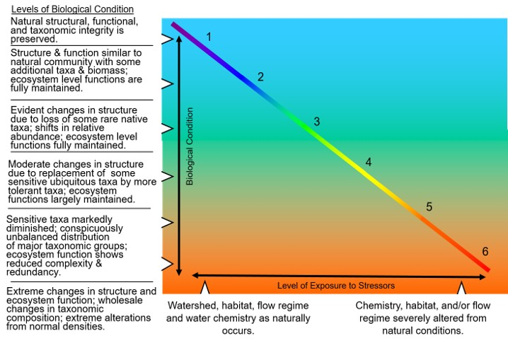

```{r setup, include=FALSE}
knitr::opts_chunk$set(echo = FALSE
                      , results = 'asis'
                      , warning = FALSE
                      , message = FALSE)
```

# Quick Tutorial

This R-based tool calculates Biological Condition Gradient (BCG) scores
for macroinvertebrate and fish assemblages at sites on the mainstem of
the Lower Boise River in Idaho. This report (Report Placeholder)
describes the calibration of the BCG models.

Users can run any samples through this calculator and obtain a result.
However, if samples were not collected and processed using these field
and laboratory protocols <a href="https://github.com/Blocktt/LowerBoiseBCGCalc/blob/main/inst/apps/LowerBoiseBCGCalc/www/links/Methods_Bugs_Fish_20260525.pdf" target="_blank">PDF</a>, results should be interpreted with
caution because they are outside the experience of the model. For those
who prefer to use R instead of this online calculator, the functions are
carried out by the <a href="https://github.com/leppott/BCGcalc" target="_blank">BCGcalc</a> and <a href="https://cran.r-project.org/web/packages/BioMonTools/index.html" target="_blank">BioMonTools</a> R packages, which
are available on GitHub and were developed by Erik W. Leppo from Tetra
Tech ([Erik.Leppo\@tetratech.com](#0)).

*If using the R code instead of the Shiny app, you won’t need internet
access if you have R installed on your computer and have downloaded all
the necessary packages.

## What is the Biological Condition Gradient?

{width="608"}

The Biological Condition Gradient (BCG) model is a conceptual model
describing how ecological attributes change in response to increasing
levels of human-caused stress. The BCG has a universal scoring scale
with six levels of biological condition, ranging from observable
biological conditions found at no or low levels of stressors (level 1)
to those found at high levels of stressors (level 6). Narratives for
each BCG level are shown in the figure above. The model is calibrated
using expert elicitation. Biologists work collaboratively to reach
consensus on assigning biological samples to BCG levels. Their ratings
and rationale are then used to calibrate a quantitative model. Model
performance is judged based on how well the model matches the expert BCG
level assignments.

## Additional resources

Synopsis: <a href="https://www.epa.gov/sites/default/files/2021-03/documents/bcg-flyer-2021.pdf" target="_blank">The Biological Condition Gradient (BCG) - A Model for Interpreting Anthropogenic Stress on the Aquatic Environment</a>

<a href="https://www.epa.gov/sites/default/files/2016-02/documents/bcg-practioners-guide-report.pdf" target="_blank">A Practitioner’s Guide to the Biological Condition Gradient: A Framework to Describe Incremental Change in Aquatic
Ecosystems</a>

------------------------------------------------------------------------

*Last updated 2025-05-27*
