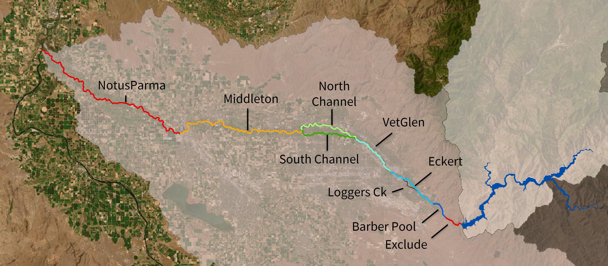
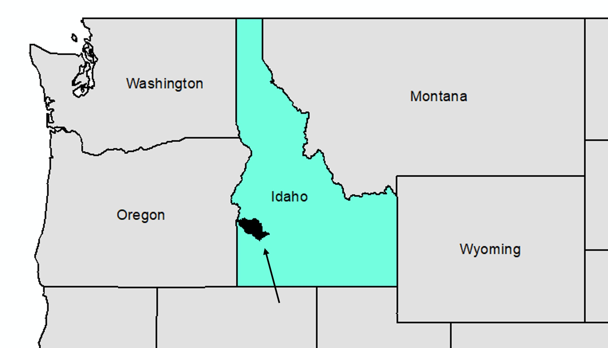

```{r setup, include=FALSE}
knitr::opts_chunk$set(echo = FALSE
                      , results = 'asis'
                      , warning = FALSE
                      , message = FALSE)
```

# Study area

This R-based tool calculates Biological Condition Gradient (BCG) model
outputs for macroinvertebrate and fish assemblages at sites on the
mainstem of the Lower Boise River in Idaho. Sites are matched with the
appropriate class/stream segment using these geospatial (shapefile and
kmz) files <a href="https://github.com/Blocktt/LowerBoiseBCGCalc/blob/main/inst/apps/LowerBoiseBCGCalc/www/links/BCG_ClassSegments2_20260304.zip" target="_blank">[ZIP]</a>.

{width="630"}

{width="630"}

------------------------------------------------------------------------

*Last updated 2026-05-27*
